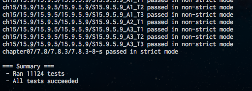

iv / lv5, ECMA262 Engine
========================

---

detail
======

- 仕様正確
    - property enumeration orderについて, デファクトスタンダードに合わせました
    - 結果, test262についてすべてpass

- もうそこそこ速い
    - 昔の(3.0くらいのころの)FirefoxのInterpreterの3倍は速い
    - 今のModern EngineのJIT付きの7倍程度遅い
        - JITなしのSpiderMonkeyとなら, 今で1.4倍遅い

---

example
=======

    !javascript
    function FixedArray(num) {
      var ary = new Array(num);
      Object.defineProperty(ary, 'length', { writable: false });
      return ary;
    }

    var fixed = FixedArray(10);
    fixed.push(10);  // 例外が起こる!

- modern engineで対応なし
- こういうろくでもない場所でもcover
- 完全に仕様準拠

---

iv overview
===========

---

VM
--

- Stack VM
- Python VMのinstructionを元に構成

その後Register VMに変化

- Register VM
- Lua VM, JavaScriptCore VMの命令セットを元に構成
    - Register VM, 資料少ない...
    - JavaScriptCore自体も, 「Lua VMを参考に作りました」
    - http://www.webkit.org/blog/189/announcing-squirrelfish/

---

example
-------

    !javascript
    function binaryAdd(a, b) {
      return a + b;
    }

to

    !cpp
    [code] local: 0 heap: 0 registers: 1
    00000: BINARY_ADD 0 4294967286 4294967285
    00004: RETURN 0
    00006: STOP_CODE

---

directory
---------

source directory tree

- iv (root)
    - iv (src, lexer / parser project. 直下にcommon的なもの)
        - phonic (iv ruby binding. 古い...)
        - aero (正規表現Engine. simpleなNFA, bytecode based)
        - lv5 (ECMAScript Engine project. 直下にJSのprimitive構成群)
            - teleporter (AST Interpreter. 遅い. 後述)
            - railgun (Register VMとBytecode Compiler)
            - radio (GCをつくろうと構成. まだできていないので, BoehmGC)

---

modules 1
---------

- iv
    - lexerとparser, 及び共通部のlibraryを構成
- aero
    - 正規表現のengine. 正規表現のVM上で動く. simpleなんですけど, 意外とそこまで遅くない.

---

modules 2
---------

- lv5
    - ECMAScript Engine
- teleporter
    - ASTを逐次解釈するInterpreter. 初期の実装. 今は使っていません. ただ, これが残っているのは理由があって, 実は全く最適化とか考えなかった結果, ECMA262の仕様書で記述されているinterpretation algorithmをそのまま書き下したものになっていて, ちょっと貴重. railgunと比べて10から30倍以上遅い...
- railgun
    - Bytecode CompilerとRegister VM. この間までStack VMでしたが, Register VMになりました. Stack VMからRegister VMに移って, Compilerのsource codeが4倍くらいになりました...

---

disassemble
===========

interactive shellのdis関数が利用可能

    > dis(function test(a, b) { return a; });
    [code] local: 0 heap: 0 registers: 1
    00000: LOAD_CALLEE 0
    00002: RETURN 4294967286
    00004: STOP_CODE
    true

--disでbytecodeを出力

    lv5 --dis filename

--disだけつけて, fileを与えない場合, disasm付きのinteractive shellになり, 解釈ごとにdisasm結果が表示される

    lv5 --dis

----

flow - main
===========

- main.ccから
- fileを読み込み, lv5のrailgun::Contextが作成される
- ivのparserがfileからASTを構築
- railgun::CompilerがASTからCodeにCompile
    - bytecodeを持つobject. 内部の関数の本体
- ContextのもつVMにCodeをわたしてRun
    - `ctx.vm()->Run(code, &e);`

----

flow - parser
=============

- もらったstringからASTを構築
- この際, 使われていない変数, 別の関数から参照されている変数(クロージャで環境に確保すべき変数), stackに置いてもいい変数などの情報を集めている.

----

flow - compiler
---------------

- ASTに対してVisitorが動作
- compiler_statement.h
    - statementのcompile
- compiler_expression.h
    - expressionのcompile
- compiler.h
    - 共通部
- Compiler動作単位ごとに大きな一つのbufferが取られ, このbuffer上に全てのbytecodeがemitされる
- Codeはこのbufferへの参照と, 自身のbytecodeがこのbufferのoffsetいくつから始まるかという情報をもつ

---

lv5::runtime
============

---

runtime
=======

- JSのruntime object
    - iv/lv5/jsxxxx.h に定義されている
    - 例えば, jsarray.hにJSArrayの実装が
- 標準関数
    - runtime\_xxxxx.hに定義されている
    - 例えば, Math.sinの実装はruntime\_math.hのruntime::MathSin
- runtimeはteleporterとrailgunで共通
    - runtimeにとってVMで実行しているかAST Interpreterで実行しているかは関係ない
    - 抽象化
    - lv5 directory直下

---

環境構築
========

- 実行環境はContextにまとめられる
    - GlobalObjectなどやVM, Stackなどを保持
    - Contextごとに完全に独立
        - SymbolTableから別
    - なので, 複数Contextにまたがる処理を行わない限りは複数VMを立てられる
        - Contextごとにthreadで別に処理をおこなっても大丈夫
- ContextのInit部分で標準関数などがGlobalにassignされる
    - context.cc

---

railgun::VM
===========

---

VM - opcode
===========

- Bytecodeをもらって, このbytecodeの情報から必要な命令を実行
- 例えば, MV命令, MV dst, srcの場合

        !cpp
        DEFINE_OPCODE(MV) {
          // opcode | dst | src
          REG(instr[1].i32) = REG(instr[2].i32);
          DISPATCH(MV);
        }

----

VM - main loop
==============

- for文の中にswitch文が書かれている. DEFINE_OPCODEはcase

        !cpp
        for (;;) {
          switch (instr->value) {
            DEFINE_OPCODE(MV) {
              ...
              DISPATCH(MV);
            }
          }
          ...   // error handling (check try-catch-finally, unwind frame, etc)
        }

- DISPATCHはcontinue, forの開始直後に飛べる
- Errorが起こるとbreakする, するとswitch直後に飛べる
- ただしdirect threading可能な場合は, これがlabelに変化, DISPATCHはgotoへ

----

instruction general 1
=====================

- instructionの単位は, それぞれのsystemのpointerのbit幅と同じ
    - 32bit systemなら32bit, 64bit systemなら64bit
    - direct threadingを行うためには, gotoのlabelをinstructionに格納する必要がある.
- instructionはunionで, int32\_t, uint32\_tやpointerを格納している
    - tagはついていないので, opcode依存で取り出す
- RegisterVMなので, registerを引数に取る

----

instruction general 2
=====================

- registerは無限長
    - frame上に構築される. このframeはVMのstack上に構築される.
    - compilerはframeの大きさを解析可能なので, 関数呼び出し前にVM stackが溢れないか調査できる

            !javascript
            function test() {
              test();
            }
            test();    // RangeError: maximum call stack size exceeded

- registerの指定はint32\_t
    - 負数のregister番地を指す場合がある
        - arguments. 後述

----

code
====

- bytecode
- strict codeかどうか
- codeが実行に必要とするregisterの数
    - この情報をつかって, frameをVM stackからallocateする
- シンボルプール (シンボルの配列)
    - bytecodeはSymbolにindexでアクセスし, ここから取り出す
- 定数プール (JSにおける定数の配列)
    - bytecodeは定数を引き出す時にここからindexで取り出す
- コードプール
    - このCodeの内部で定義されているCodeのプール
    - FunctionLiteralがここからCodeを引っ張り出して, Function Objectを作る
- 例外ハンドラテーブル
    - finallyとcatchのテーブル
    - 確保する範囲, jmpに戻るときのaddressを確保すべきregisterなどが登録されている

----

frame layout
============

frameは以下のようなlayoutを予定.

    ARG2 | ARG1 | THIS | FRAME.... | LOCAL REGISTERS | HEAP REGISTERS | TEMP ...
                       ^           ^
                       fp          register start

argumentsはregister最右端に逆順につまれる. JSはargumentsの数があっていなくてもいいので.

これにより, 先のframeから, registerの負数の番地, 例えば, r-7などでargumentsをregisterとして扱うことができる. (register windowのslide) この-の値には, frame structのsizeをregisterのsizeで割ったものが利用され, これはsizeof周りでlv5のcompile時に分かる.

frameには現在の環境や, 返り値を入れるregisterの番号, 戻り先pcなど制御情報が入っている. alignmentをあわせてallocateされているため, JSValの配列であるVM stack上に直接確保可能.

local変数で, 別の関数から参照されないものは, register上に直接置かれる. (local registers)

残りは計算用のtemporary registers.

---

instruction detail
==================

instructionはその長さと共に全てop.hに定義されている. すべてで120程度.
将来的にここに多少のoptimizedな命令と, heap環境spill命令が追加予定.

また, vm.hのそれぞれのopcodeの実行部に多少の説明.

現在registerに取るのは本当にregisterの値だけで, つまりtemporaryとlocal registerとarguments register.
しかし, Register VMの醍醐味は(Lua, JSC調べ), 全てのものをregisterにすること.

---

instruction example
===================

- example
    - BINARY\_ADD

            opcode | dst | lhs | rhs

        - lhs, rhsレジスタの値を取り出し, ADD演算を行なって, dstレジスタに格納

    - LOAD\_CONST

            opcode | dst | offset

        - dstレジスタに定数プールから[offset]のものを格納

    - IF\_FALSE

            opcode | jmp | cond

        - condの値がfalseに評価できるならばjmpに格納されている相対量分pcを移動

---

instruction optimization (WIP)
==============================

- 定数プール参照
- ヒープ参照

---

定数プール参照
--------------

Stack VMの場合は全ての値を一度stackに置く, つまり評価した後, これを利用するため, 何の価値もなかったが, Register VMの場合はopcodeが直接registerを指せるので, すべてのものをregister扱いすることは効果が高い.

例えば, 定数プールの値をoffset 0から決め, それにtagを付け, `(0x80 | offset)` として, レジスタアクセスにおいて, `!!(reg & 0x80) == true`ならばconstant poolから引っ張り出すというふうに実装したとする. すると, 従来必要であったLOAD\_CONST命令が要らなくなり, addなどが一発で利用できる.

ただし, この実装はまだ未検証. Lua, JSCなどがやっている分, おそらく効果があるのではないかと考えられるが, 実際にやってみて判断してみたいところ.

    BINARY_ADD r0, r1, c0

ここで, c0は定数プール0番という風に.

---

ヒープ参照
----------

現在行おうと考えている実装. ヒープ環境に置くべき値をframeが破棄されるまではregisterに置くことで, 直下環境での演算が全てregisterに対する演算となる.

JSCなどが実装している手法.

ただし, 非常に細かな計算が必要であり, 細心の注意を払う必要がある.
というのも, heap registerに対する副作用の計算を最新の注意を払って実装しなければいけないためである.
現在実装を検討.

---

railgun::Compiler
=================

---

Intro
-----

最初に

__compilerの実装は現在自分でもげんなりするほどスパゲティとなっております__

Stack VMの頃は, 今と比べればずっと綺麗だったのですが, Register VMに切り変わったのがこの2月の頭ということもあって, まだ鋭意refactoring中 + optimizationとして実装したい機能の実装が終わっていないのでまだ作業中, ということもありまして...

しかし, test262は全てpass + test/lv5/suite以下にある自分でtestを追加できる機構としてもpass.

---

change Stack VM to Register VM
------------------------------

Stack VMにおいて, ある場所にあるopcodeがpushする先のindexはframeの底から数えて常に同じである.

同じでないとすれば, あるpathを通ってここまできた場合と, 違う場合でstackに残る値の数が異なるという事態が起こる. そのようなことはありえない(あったらbug)

---

example
-------

example

    !javascript
    function test(a, b) {
      return a + b;
    }

Stack VM bytecode

    !cpp
    [code] depth: 4 local: 2 heap: 0
    00000: LOAD_PARAM 0    // ここでは常に[0]に値をpush
    00002: STORE_LOCAL 0
    00004: POP_TOP         // ここでは常に[0]の値をpop
    00005: LOAD_PARAM 1    // ここでは常に[0]に値をpush
    00007: STORE_LOCAL 1
    00009: POP_TOP         // ここでは常に[0]の値をpop
    00010: LOAD_LOCAL 0    // ここでは常に[0]に値をpush
    00012: LOAD_LOCAL 1    // ここでは常に[1]に値をpush
    00014: BINARY_ADD      // ここでは常に[0]と[1]で計算, [0]に値をpush
    00015: RETURN          // 個々では常に[0]をreturn, pop
    00016: STOP_CODE

---

initial Register VM
===================

ならば, これをそのままregisterの値として置き換えれば, 初期的なRegister VMが完成

Register VM bytecode + initial

    !cpp
    [code] depth: 4 local: 2 heap: 0
    00000: LOAD_PARAM r0 0
    00002: STORE_LOCAL r0 0
    00005: LOAD_PARAM r0 1
    00007: STORE_LOCAL r0 1
    00010: LOAD_LOCAL r0 0  // local変数[0]をr0に
    00012: LOAD_LOCAL r1 1  // local変数[1]をr1に
    00014: BINARY_ADD r0 r0 r1
    00015: RETURN r0
    00016: STOP_CODE

---

issue 1: local variable
=======================

ここで, local変数はStack VMでもstack上におかれているので, register VMでもregisterに置くことができる. 先ほどのLOAD\_LOCAL / STORE\_LOCALをMVに書き換える. local変数は2つなので, stack部分, つまりtemporaryなregisterは2からはじめる.

Register VM bytecode + MV

    !cpp
    [code] depth: 4 local: 2 heap: 0
    00000: LOAD_PARAM r2 0
    00002: MV r0 r2  // もとSTORE_LOCAL
    00005: LOAD_PARAM r2 1
    00007: MV r1 r2  // もとSTORE_LOCAL
    00010: MV r2 r0  // もとLOAD_LOCAL, local変数r0をr2に
    00012: MV r3 r1  // もとLOAD_LOCAL local変数r1をr3に
    00014: BINARY_ADD r2 r2 r3
    00015: RETURN r2
    00016: STOP_CODE

で, これを見ると, 明らかに無駄なMV...

---

Register VM + local register
============================

今, Register VMはlocal変数をregisterで表し, かつregisterを演算に引き取れるので,

Register VM bytecode + use local

    !cpp
    [code] depth: 4 local: 2 heap: 0
    00000: LOAD_PARAM r0 0  // local r0に直接
    00005: LOAD_PARAM r1 1  // local r1に直接
    00014: BINARY_ADD r2 r0 r1  // 演算結果をr2のtemporary registerに
    00015: RETURN r2
    00016: STOP_CODE

---

Register VM++
============================

JavaScriptは,

- 引数の数があっていない場合はundefinedで埋められる
- 多すぎる場合は見えないだけ
    - でもargumentsでみると見える

このため, 素直にStack VMのように評価した順に積んだ場合, 呼び出し側でstackにいくつ積まれたかによって, 呼び出され側から見た引数の場所が変わってしまうので, compile時に判断できない.

---

Call Convention
===============

ところが, Stack VMではなくなったRegister VMでは, 評価した値を別のoffsetに明示的に積むことができる. つまり, 評価の逆順に積んでいくことができる.

    [arg3][arg2][arg1][arg0][this][frame...]

すると, frame側から見て, arg0は常に-1の場所にあることになる. これにより, argumentsをそのままregisterとして用いることが可能.

問題はargumentsが少なかった時, つまりcallee側は3引数あると思ってr-3まで使っているのに2つしか積んでいなかった時

この場合は, frameを作る時に数を数えて, 足りなければ, 横にずらすことでうまくいく.

---

Register VM + arguments opt
===========================

Register VM bytecode + arguments opt

    !cpp
    [code] depth: 4 local: 2 heap: 0
    00014: BINARY_ADD r0 r-2 r-3
    00015: RETURN r0
    00016: STOP_CODE

現行railgun::Compilerのemitするcode

---

RHS side effects
================

Register VMのソースコードがくちゃくちゃになっている元凶

今, 以下のscript

    !javascript
    function test() {
      var a = 10;
      return a + (a = 20);
    }

を考える. この時, aをr0として, 単純においてしまうと, こうなるのではないか?

    !cpp
    LOAD_INT32 r0 10  // var a = 10;
    LOAD_INT32 r0 20  // (a = 20)
    BINARY_ADD r1 r0 r0  // a + (a = 20) ? えっ!
    RETURN r1

問題は, Stack VMの場合はstackに積んでいた, copyしていたので, いわば評価済みであったのに対して, Register VMがlocal変数のregisterをそのまま使ってしまうことにより, 評価されず, ここがあとで書き変わってしまう自体が起こっている.

RHSでの副作用に注意しなければいけない.

---

solution 1
==========

RHSに副作用を起こすものがあるときには, 値をMVで退避させれば良い. JSCがこれを採用. lv5のVMの初期実装もこれを採用.

いま, a = 10が副作用があると判断されたので, aをMVする.

    !cpp
    LOAD_INT32 r0 10  // var a = 10;
    MV r1 r0          // 退避!
    LOAD_INT32 r0 20  // (a = 20)
    BINARY_ADD r1 r1 r0
    RETURN r1

このやり方でうまくいく. ちなみに, Compilerの本を読んだ限りでは, 一般には, 上の場合をすべてMVしてしまい, そしてその後DAGを作って不要な変数のMVを複写伝搬解析で取り除くというものが定石.

SSA formを採用すれば, 変数の代入ごとに別のラベルがつくので, そもそもこの問題が起きない.

ただ, VMのbytecode compilerの場合, __実行前に時間をかけてコンパイルするなどもっての外__という問題があり, 結果, 1 passでかなりいい感じのcodeを吐く手段として上のものが用いられている.

---

solution 1欠点
==============

もちろん, 副作用がRHSにあるかどうかは, parserが事前に計算しておけばいいが, labelごとにセットを作るわけにもいかないので, 副作用があるなし程度の情報になってしまう.

    !javascript
    function test() {
      var a = 10;
      var b = 30;
      return b + (a = 20);
    }

が

    !cpp
    LOAD_INT32 r0 10  // var a = 10;
    LOAD_INT32 r1 10  // var b = 30;
    MV r2 r1          // いらないけれど退避...
    LOAD_INT32 r0 20  // (a = 20)
    BINARY_ADD r2 r2 r0
    RETURN r2

`(a = 20)` が副作用ありと判断された結果, MVせざるを得なくなっている.

もちろん, (a = 20)が変数aに対する副作用であるということを記録することが出来ればいいのだが, それをするとexprの各nodeに副作用セットを格納する必要があり, 利用頻度に対してコストが高すぎる.

---

solution 2
==========

1月半ば, 某アニメの2期決定に敬意を表して, コンビニにラムレーズンを買いに行ったところ, ふと思いついた方法がありまして...

今, 評価されていないけれど後で使う変数をlistに保管しておき, その変数に対して副作用が起こるbytecodeがemitされそうになったら, その変数を退避させる.

    !javascript
    function test() {
      var a = 10;
      var b = 30;
      return b + (a = 20);
    }

が

    !cpp
    LOAD_INT32 r0 10  // var a = 10;
    LOAD_INT32 r1 10  // var b = 30;
                      // まず, bが評価され, これはregister直接使えることが分かる
                      // listにr1を入れておく.
    LOAD_INT32 r0 20  // r1には影響なし
    BINARY_ADD r2 r1 r0
    RETURN r2

---

solution 2 spill ver
====================

一方,

    !javascript
    function test() {
      var a = 10;
      return a + (a = 20);
    }

が

    !cpp
    LOAD_INT32 r0 10  // var a = 10;
                      // まず, aが評価され, これはregister直接使えることが分かる
                      // listにr0を入れておく.

                      // ここで r0へのLOAD_INT32をemitしそうになる.
                      // 書き込み先のr0がlistに入っているので, これを急遽MV
    MV r1, r0
    LOAD_INT32 r0 20
    BINARY_ADD r1 r1 r0
    RETURN r1

となり, 本当に書き換わる時のみregisterを退避させることができる.

実装上は, ThunkとThunkListというもので行なっている.

---

spill implementation
====================

ただ, これを利用すると, いきなりMVが入る可能性があるという問題点があり, 一部の場所では利用できないので, railgun::Compilerはsolution 1とsolution 2を両方, 必要な所で利用している.

example:

- CallSite
    - 逆順にregisterを積む必要があるので, 思わぬ所でspillが入ってしまうと困る
        - 事前にspillする可能性のあるものはspill

---

benchmark result
================

SunSpider benchmark result (spent time. smaller is faster)

- プロシンの予稿作成時点での速度, StackVM
    - 1830.0ms
- RegisterVMに変更直前のStackVM
    - 1641.6ms
- RegisterVM.initial
    - 1576.6ms
- RegisterVM.current
    - 1420.0ms

---

questions
=========
