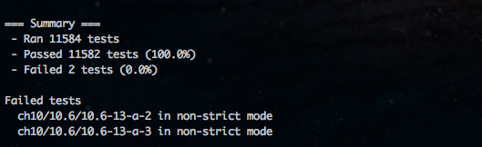
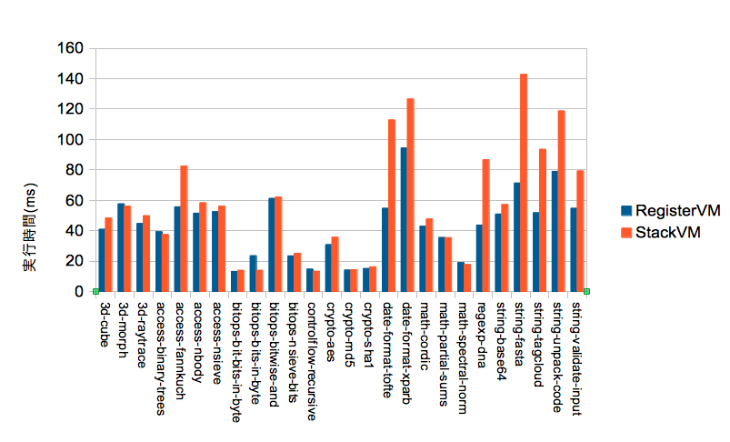

iv / lv5, ECMA262 Engine
========================

サイボウズ・ラボユース最終成果報告会

@Constellation

Yusuke Suzuki

---

detail
======

- 仕様正確
    - property enumeration orderについて, (仕方なく)デファクトスタンダードに合わせました
        - 今度test262中にはびこる依拠testをまとめてtest262-discussに投げようかと
    - test262, 現在11582件中, 2 fails

- 2 failsはtest262のbugで, すでにreportされています
    - https://bugs.ecmascript.org/show_bug.cgi?id=288

---

contribution
============

- lv5がfailする
    - lv5のほうが正しいときがちらほら
    - test262にbug report (とか, 修正を手伝ったりとか)
        - https://bugs.ecmascript.org/show_bug.cgi?id=215
        - https://bugs.ecmascript.org/show_bug.cgi?id=218
        - https://bugs.ecmascript.org/show_bug.cgi?id=270
        - https://bugs.ecmascript.org/show_bug.cgi?id=288
        - https://bugs.ecmascript.org/show_bug.cgi?id=287
        - https://bugs.ecmascript.org/show_bug.cgi?id=294

---

優位点
=====

- lv5は仕様を満たすことを第1に考える
- また, デファクト挙動のようなものは, なるべく関知しない

結果, test262の, デファクト挙動に依拠したtestをあぶり出すことができる.

---

example1 - ArrayProperty
========================

    !javascript
    function FixedArray(num) {
      var ary = new Array(num);
      Object.defineProperty(ary, 'length', { writable: false });
      return ary;
    }

    var fixed = FixedArray(10);
    fixed.push(10);  // 例外が起こるべき

- こういったedge caseについて, modern engineで対応なし
- Arrayの最適化で, 仮定を置きすぎてattributesが考慮できてないpattern

---

example2 - LHS
==============

    !javascript
    function test() {
      var i = 0, obj;
      try {
        i = (obj = {
          flag: false,
          valueOf: function() {
            this.flag = true;
            throw new Error;
          }
        }) += 10;
      } catch (e) {
        return i === 0 && obj.flag;
      }
    }
    test();

- こういうedge caseにひたすら対応
- 仕様の重箱の隅

---

iv overview
===========

---

VM
==

- Stack VM
- [『スクリプトエンジン プログラミング』](http://www.amazon.co.jp/dp/4797347627)
- [『Java仮想マシン仕様 (The Java series) 』](http://www.amazon.co.jp/dp/489471356X)
- Python VM
- YARV
- 例外をstack bottomにおいておくとかそういう

----

VM
==
その後Register VMに

- Register VM
- [『言語実装パターン』](http://www.amazon.co.jp/dp/4873115329)
- Lua VM, JavaScriptCore VMを参考に
    - [The Implementation of Lua 5.0](http://www.lua.org/doc/jucs05.pdf)
- http://www.webkit.org/blog/189/announcing-squirrelfish/

---

instruction1
============

- opcodeの単位は64bit固定, これにoperandがつく
    - direct threadingを行うためには, gotoのlabelを格納する必要がある
    - system sizeという風に不定にすると, 畳み込みが面倒なので, 64bitに固定
- instructionはunionで, int32\_t, uint32\_tやpointerを格納している
    - 64bitのunionにいろいろな情報をたたみ込む
    - tagはついていないので, opcode依存で取り出す
- RegisterVMなので, registerを引数に取る

----

instruction2
============

- registerは無限長
    - frame上に構築される. このframeはVMのstack上に構築される.
    - compilerはframeの大きさを解析可能なので, 関数呼び出し前にVM stackが溢れないか調査できる

            !javascript
            function test() {
              test();
            }
            test();    // RangeError: maximum call stack size exceeded

- registerの指定はint16\_t
    - 負数のregister番地を指す場合がある
        - arguments. 後述
- RegisterVMのstackの最大サイズはこちらが把握しているので, int16\_tに意図的にすることで, union中に効率よく格納

----

code
====

- bytecode
- strict codeかどうか
- codeが実行に必要とするregisterの数
- シンボルプール (シンボルの配列)
- 定数プール (JSにおける定数の配列)
- コードプール
- ハンドラテーブル
    - finallyとcatch, iterator, withのハンドラのテーブル

----

frame layout
============

frameは以下のようなlayout

    ARG2 | ARG1 | THIS | FRAME.... | LOCAL REGISTERS | HEAP REGISTERS | TEMP ...
                       ^           ^
                       fp          register start

argumentsはregister最右端に逆順につまれる. JSはargumentsの数があっていなくてもいいので.

これにより, 先のframeから, registerの負数の番地, 例えば, r-7などでargumentsをregisterとして扱うことができる. (register windowのslide) この-の値には, frame structのsizeをregisterのsizeで割ったものが利用され, これはsizeof周りでlv5のcompile時に分かる.

frameには現在の環境や, 返り値を入れるregisterの番号, 戻り先pcなど制御情報が入っている. alignmentをあわせてallocateされているため, JSValの配列であるVM stack上に直接確保可能.

local変数で, 別の関数から参照されないものは, register上に直接置かれる. (local registers)

残りは計算用のtemporary registers.

---

instruction detail
==================

- 現在registerに取るのは本当にregisterの値だけで, つまりtemporaryとlocal registerとarguments register.
- JSCやLuaは, 定数値をtagをつけてregisterに埋め込む
    - register lookupのたびに分岐が必要で, 高速化どうかは疑問, ということでlv5では採用しなかった
- また, JSCやLuaはHeap変数を一時的にstackにおき, frameが破棄されると共にcloseする
    - LuaのUpvar, 実装しようか検討中

---

instruction example
===================

- example
    - BINARY\_ADD

            opcode | dst | lhs | rhs

        - lhs, rhsレジスタの値を取り出し, ADD演算を行なって, dstレジスタに格納

    - LOAD\_CONST

            opcode | dst | offset

        - dstレジスタに定数プールから[offset]のものを格納

    - IF\_FALSE

            opcode | jmp | cond

        - condの値がfalseに評価できるならばjmpに格納されている相対量分pcを移動

---

Compiler
=================

---

change Stack VM to Register VM
------------------------------

Stack VMにおいて, ある場所にあるopcodeがpushする先のindexはframeの底から数えて常に同じである.

同じでないとすれば, あるpathを通ってここまできた場合と, 違う場合でstackに残る値の数が異なるという事態が起こる. そのようなことはありえない(あったらbug)

---

example
-------

example

    !javascript
    function test(a, b) {
      return a + b;
    }

Stack VM bytecode

    !cpp
    [code] depth: 4 local: 2 heap: 0
    00000: LOAD_PARAM 0    // ここでは常に[0]に値をpush
    00002: STORE_LOCAL 0
    00004: POP_TOP         // ここでは常に[0]の値をpop
    00005: LOAD_PARAM 1    // ここでは常に[0]に値をpush
    00007: STORE_LOCAL 1
    00009: POP_TOP         // ここでは常に[0]の値をpop
    00010: LOAD_LOCAL 0    // ここでは常に[0]に値をpush
    00012: LOAD_LOCAL 1    // ここでは常に[1]に値をpush
    00014: BINARY_ADD      // ここでは常に[0]と[1]で計算, [0]に値をpush
    00015: RETURN          // 個々では常に[0]をreturn, pop

---

initial Register VM
===================

ならば, これをそのままregisterの値として置き換えれば, (初期的な)Register VMが完成

Register VM bytecode

    !cpp
    [code] depth: 4 local: 2 heap: 0
    00000: LOAD_PARAM r0 0
    00002: STORE_LOCAL r0 0
    00005: LOAD_PARAM r0 1
    00007: STORE_LOCAL r0 1
    00010: LOAD_LOCAL r0 0  // local変数[0]をr0に
    00012: LOAD_LOCAL r1 1  // local変数[1]をr1に
    00014: BINARY_ADD r0 r0 r1
    00015: RETURN r0

---

issue 1: local variable
=======================

ここで, local変数はStack VMでもstack上におかれているので, register VMでもregisterに置くことができる. 先ほどのLOAD\_LOCAL / STORE\_LOCALをMVに書き換える. local変数は2つなので, stack部分, つまりtemporaryなregisterは2からはじめる.

Register VM bytecode + MV

    !cpp
    [code] depth: 4 local: 2 heap: 0
    00000: LOAD_PARAM r2 0
    00002: MV r0 r2  // もとSTORE_LOCAL
    00005: LOAD_PARAM r2 1
    00007: MV r1 r2  // もとSTORE_LOCAL
    00010: MV r2 r0  // もとLOAD_LOCAL, local変数r0をr2に
    00012: MV r3 r1  // もとLOAD_LOCAL local変数r1をr3に
    00014: BINARY_ADD r2 r2 r3
    00015: RETURN r2

で, これを見ると, 明らかに無駄なMV...

---

Register VM + local register
============================

今, Register VMはlocal変数をregisterで表し, かつregisterを演算に引き取れるので,

Register VM bytecode + use local

    !cpp
    [code] depth: 4 local: 2 heap: 0
    00000: LOAD_PARAM r0 0  // local r0に直接
    00005: LOAD_PARAM r1 1  // local r1に直接
    00014: BINARY_ADD r2 r0 r1  // 演算結果をr2のtemporary registerに
    00015: RETURN r2

---

Register VM++
============================

JavaScriptは,

- 引数の数があっていない場合はundefinedで埋められる
- 多すぎる場合は見えないだけ
    - でもargumentsでみると見える

このため, 素直にStack VMのように評価した順に積んだ場合, 呼び出し側でstackにいくつ積まれたかによって, 呼び出され側から見た引数の場所が変わってしまうので, compile時に判断できない.

---

Call Convention
===============

ところが, Stack VMではなくなったRegister VMでは, 評価した値を別のoffsetに明示的に積むことができる. つまり, 評価の逆順に積んでいくことができる.

    [arg3][arg2][arg1][arg0][this][frame...]

すると, frame側から見て, arg0は常に-1の場所にあることになる. これにより, argumentsをそのままregisterとして用いることが可能.

問題はargumentsが少なかった時, つまりcallee側は3引数あると思ってr-3まで使っているのに2つしか積んでいなかった時

この場合は, frameを作る時に数を数えて, 足りなければ, 横にずらすことでうまくいく.

---

Register VM + arguments opt
===========================

Register VM bytecode + arguments opt

    !cpp
    [code] local: 0 heap: 0 registers: 1
    000000: BINARY_ADD r0 r-10 r-11
    000002: RETURN r0

現行railgun::Compilerのemitするcode

---

RHS side effects
================

今, 以下のscript

    !javascript
    function test() {
      var a = 10;
      return a + (a = 20);
    }

を考える. この時, aをr0として, 単純においてしまうと, こうなるのではないか?

    !cpp
    LOAD_INT32 r0 10  // var a = 10;
    LOAD_INT32 r0 20  // (a = 20)
    BINARY_ADD r1 r0 r0  // a + (a = 20) ? えっ!
    RETURN r1

問題は, Stack VMの場合はstackに積んでいた, copyしていたので, いわば評価済みであったのに対して, Register VMがlocal変数のregisterをそのまま使ってしまうことにより, 評価されず, ここがあとで書き変わってしまう自体が起こっている.

RHSでの副作用に注意しなければいけない.

---

copy
====

Compilerの定石としては, ここでやるのではなく, 後で複写を削除する.

しかし, VMのBytecode Compilerは高速にBytecodeを出力しないといけない.

1 passで, 複雑なデータ構造(Graph)を作らずに, が望ましい.

---

Lua
===

そもそもそのような文法は許諾していない.
また, 未定義とする.

    !lua
    function p()
      local x = 0
      function inner()
        x = 20
        return 1000
      end
      print(x + inner())
    end
    p()  -- 1020

JSならば, 1000となるべき

----

JSC solution
============

JSCのとっている方法.
RHSにregisterに対して副作用を起こすものがあるときには, 値をMVで退避させれば良い.

いま, a + (a = 20)について, a = 20が副作用があると判断されたので, aをMVする.

    !cpp
    LOAD_INT32 r0 10  // var a = 10;
    MV r1 r0          // 退避!
    LOAD_INT32 r0 20  // (a = 20)
    BINARY_ADD r1 r1 r0
    RETURN r1

このやり方でうまくいく.

----

欠点
====

もちろん, 副作用がRHSにあるかどうかは, parserが事前に計算しておけばいいが, labelごとにセットを作るわけにもいかないので, 副作用があるなし程度の情報になってしまう.

    !javascript
    function test() {
      var a = 10;
      var b = 30;
      return b + (a = 20);
    }

が

    !cpp
    LOAD_INT32 r0 10  // var a = 10;
    LOAD_INT32 r1 10  // var b = 30;
    MV r2 r1          // いらないけれど退避...
    LOAD_INT32 r0 20  // (a = 20)
    BINARY_ADD r2 r2 r0
    RETURN r2

`(a = 20)` が副作用ありと判断された結果, MVせざるを得なくなっている.

もちろん, (a = 20)が変数aに対する副作用であるということを記録することが出来ればいいのだが, それをするとexprの各nodeに副作用セットを格納する必要があり, 利用頻度に対してコストが高すぎる.

----

lv5
===

lv5の実装. コンビニにラムレーズンアイスを買いに行った時に思いついた方法を実装.

そもそも, これが問題になるのは何かというと, Stack VMのときはいちいちStackにcopyしていた, ある種評価していたのに, Register VMでは評価しなくなったのが問題.

今, 評価されていないけれど後で使う変数をmap上にlistとして保管しておき, その変数に対して副作用が起こるbytecodeがemitされそうになったら退避させる.

以前話した際には, CoW的という評価を.

不勉強で申し訳ないのですが, 何か名前が付いているのであれば教えていただければありがたいです.

----

問題ない場合
===========

    !javascript
    function test() {
      var a = 10;
      var b = 30;
      return b + (a = 20);
    }

が

    !cpp
    LOAD_INT32 r0 10  // var a = 10;
    LOAD_INT32 r1 10  // var b = 30;

                      // map[r1]にr1をつないでおく.
    LOAD_INT32 r0 20  // r1には影響なし
    BINARY_ADD r2 r1 r0
    RETURN r2

----

spill ver
=========

一方,

    !javascript
    function test() {
      var a = 10;
      return a + (a = 20);
    }

が

    !cpp
    LOAD_INT32 r0 10  // var a = 10;

                      // まず, aが評価され, これはregister直接使えることが分かる
                      // map[r0]にr0をつないでおく.
                      // ここで r0へのLOAD_INT32をemitしそうになる.
                      // map[r0]が空でないので, これを急遽MV
    MV r1, r0
    LOAD_INT32 r0 20
    BINARY_ADD r1 r1 r0
    RETURN r1

となり, 本当に書き換わる時のみregisterを退避させる, 効率的なcodeが1 passで生成できる.

----

spill implementation
====================

ただ, これを利用すると, いきなりMVが入る可能性があるという問題点がある.
一部の場所では利用できないので, railgun::Compilerは上の2つの両方を用いている.

example:

- CallSite
    - 逆順にregisterを積む必要があるので, 思わぬ所でspillが入ってしまうと困る
        - 事前にspillする可能性のあるものはspill

----

Aero
====

----

AeroHand RegExp Runtime
=======================

- 正規表現engine
- [Regular Expression Matching: the Virtual Machine Approach](http://swtch.com/~rsc/regexp/regexp2.html)
    - Russ CoxさんのVMによる正規表現の話
- [RE1](http://code.google.com/p/re1/)
    - Russ CoxさんのVMによる正規表現の実装, RE1
    - 非常に参考になりました
- (根幹) BackTrackをstackに積んで, matchにfailしたら, stackから下ろしてresumeする
- 大した最適化していないです......

----

AeroJIT
=======

- 上記正規表現engineのJIT compiler
- VM basedなので, Bytecodeを引き取って, そのままx64 machine codeを出力
- AssemblerにXbyakを利用
    - herumiさん(光成さん)ありがとうございます
- 実行時間にして, 半分以下になりました. まだ最適化途中.

----

benchmark result
================

SunSpider benchmark result (spent time. smaller is faster)

- StackVM (tag 0.0.1)
    - 1512.7ms
- RegisterVM (master)
    - 1136.3ms

V8 Suite

- StackVM (tag 0.0.1)
    - 10691.2ms
- RegisterVM (master)
    - 9720.3ms

---

SunSpider benchmark result
==========================

https://gist.github.com/2200277

----

みなさま

ありがとうございました

----

予備スライド
===========

----

code size
=========

- Stack VM vs Register VM
- といえばcode size
- Register VMは一般にStack VMよりもcode sizeが大きくなるとされる

----

調査
====

- 実際に測る
    - ただし, Stack VMからRegister VMに移る間に, opcode上いろいろ最適化がなされている
    - 新たなopcodeによってcode sizeが縮小されたり
    - 今回は, 著しく影響が大きいものについて配慮
        - HEAP BINDINGの初期化部が圧縮されたのをStack VMでも仮に計算
- 対象として, おそらく現在全世界で最も実行されているJavaScript codeであろう, jQueryを利用
- jQuery 1.7.1をbytecodeにcompileし, code sizeを見る

----

結果
====

- Stack VM
    - 574KB
- Register VM
    - 457KB

むしろRegister VMのほうが小さくなった. なぜか?

----

考察1
=====

- からくりがありまして
- Stack VMがdirect threadingを行なっている
    - instructionにptrを埋め込んでいる
- Register VMが, 64bitの大きさを固定して, registerなどの値を細かくたたみ込んでいる
    - VM Stackの大きさを自分で決められるので, int16\_tに収まるようにというふうにできる
    - ほとんどの命令について, sizeが2程度
        - addの3 operandが16bit * 3で64bitのpayloadにすんなり入る

----

考察2
=====

- このため, 命令において, direct threading用ptrの占める割合が著しく大きくなっている
- Stack VMの1 命令における長さが, Register VMと比較して大きい
    - RegisterVMの命令長, Stack VMの命令長 * 2程度の長さ
    - もっと差がつかないと, 採算が取れない
- Stack VMの時には必要なPOP系統の命令のお陰で, 命令数がStack VMのほうが多くなる
- このStack VMは1 operandの時に, まるまる64bit割り当ててしまっている.
    - 例えば, ここを, 16bitにたたみ込むということを検討すれば, もう少し小さくなる
- というのもあるのだが, このStack VMでは不可能
    - inline cacheが存在し, ptrをたたみ込んでしまうとGCから探索不可
    - なので, pointerの大きさで, round upする必要がある
