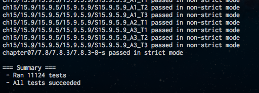
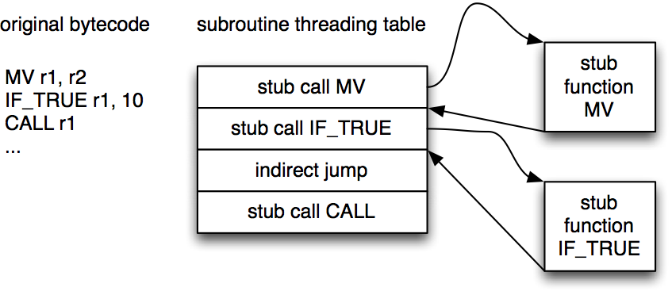
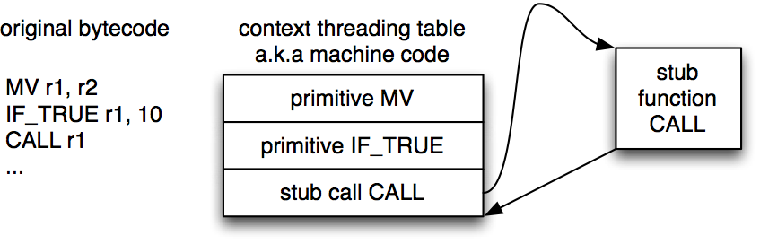
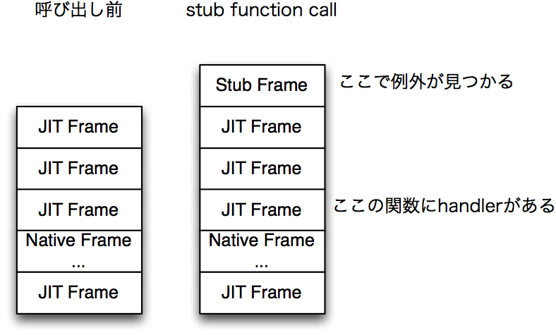
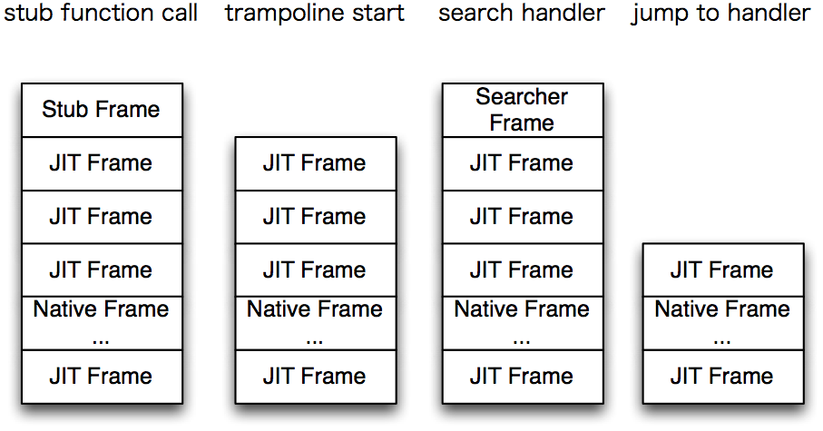

Context Threading JIT
=====================

x86/x64最適化勉強会4

@Constellation

---

自己紹介
=======

- ECMAScripter
- [iv](https://github.com/Constellation/iv)
- [hatena diary](http://d.hatena.ne.jp/Constellation/)

---

iv / lv5
========

- [iv](https://github.com/Constellation/iv)
- ECMA262 5.1th parser / lexer / Register VM / JIT compiler written in C++

---

contrib
=======

- test262にbug reportとか
    - https://bugs.ecmascript.org/show\_bug.cgi?id=215
    - https://bugs.ecmascript.org/show\_bug.cgi?id=218
    - https://bugs.ecmascript.org/show\_bug.cgi?id=270
    - https://bugs.ecmascript.org/show\_bug.cgi?id=271
    - https://bugs.ecmascript.org/show\_bug.cgi?id=287
    - https://bugs.ecmascript.org/show\_bug.cgi?id=294
- ECMA262のbug reportとか
    - https://bugs.ecmascript.org/show\_bug.cgi?id=129
    - https://bugs.ecmascript.org/show\_bug.cgi?id=387

---

Context Threading
=================

---

Context Threading
=================

- [original](http://csng.cs.toronto.edu/publications/194)
- VMの高速化法の1つ
- 皆さん周知の通りだと思いますが...

---

basic switch dispatch
=====================

- 一般的なVM

        !javascript
        for (...) {
          // opcode fetch
          opcode = ...

          switch (opcode) {
            case MV: {
              ...
              continue;  // next opcode
            }
            case THROW: {
              ...
              break;  // go to exception handler
            }
          }

          // handling exception
          ...
        }

---

direct threading
================

- opcodeを入れていたところを, labelに(codeへのpointerへ)して全て関節ジャンプへ

        !javascript
        for (...) {
          switch (opcode) {
            case MV: {
              ...
              // opcode fetch
              opcode = ...
              goto *opcode;  // next opcode
            }
          ...

---

subroutine threading
====================

- return addressなら分岐予測が効く

- IFもsubroutine callするので, returnした後対象へjmpが入り, 高cost

---

context threading
=================

- tiny opcode & branch opcodeをmachine codeへ展開
- machine codeになったので, context problemが解決し, よりよい分岐予測へ

- ここまでで8分を予定していますが大丈夫でしょうか...

---

breaker JIT Compiler
====================

---

JS VM
=====

- JavaScriptCoreがSuquirrel Fish ExtremeでContext Threading JIT
    - a.k.a baseline JIT in JSC
    - [Surfin' Safari - Introducing SquirrelFish Extreme](http://www.webkit.org/blog/214/introducing-squirrelfish-extreme/)
    - SquirrelFish(一つ前)でRegister VMになったので, そのRegister VM bytecodeをparseしてmachine codeをemit
    - 関数単位でJITするため, method JITとも呼ばれます
- SpiderMonkey JeagerMonkey
    - a.k.a method JIT in SpiderMonkey
    - [JaegerMonkey](https://wiki.mozilla.org/JaegerMonkey)
    - TracingのbailoutによるInterpreter backの極端な性能劣化を回避
        - 今はtracingは消えて([SpiderMonkey is on a diet](http://blog.mozilla.org/nnethercote/2011/11/01/spidermonkey-is-on-a-diet/)), 代わりにIonMonkeyが
    - SpiderMonkeyのStack VM bytecodeをparseしてmachine codeをemit

---

iv / lv5 / breaker
==================

- railgun VM
    - Register VM inspired from Lua and JSC
- このrailgun bytecodeをparseしてmachie codeをemit
- breaker JIT compiler

---

Compiler
========

- まず1回全てのbytecodeをscanして, jumpの飛び先を回収
    - labelを割り付けるため
- その後, もう一度bytecodeをscanしながらbytecodeに対応するmachine codeをemit
    - この時, jumpの飛び先, jump opcodeがわかっているので, basic blockの分割は可能
- あとはそれを実行するだけ!
    - simple
- Assemblerとして, Xbyakを使っています.
- 今のところ, x64のみ
    - ARMはやらないといけない気もしますね...

---

Compiler
========

- breaker::Compiler#EmitMV

        !cpp
         // opcode | (dst | src)
         void EmitMV(const Instruction* instr) {
           const int16_t dst = Reg(instr[1].i16[0]);
           const int16_t src = Reg(instr[1].i16[1]);
           LoadVR(asm_->rax, src);
           asm_->mov(asm_->qword[asm_->r13 + dst * kJSValSize], asm_->rax);
           set_last_used_candidate(dst);

           // type propagation
           type_record_[dst] = type_record_[src];
         }

---

Exception
=========

- machine codeになったけれども例外を対処しなければいけない
- VMの際はVM loopからbreakで抜けることで例外check部へ行き, stack frameをunwindしながらhandlerを検索, 見つかるとjumpするという仕組みであった

</img>

- Context Threading JITは関数を呼び出している
    - そこから例外check部へどうやって?

---

Exception
=========

- 手順
    - return addressをまず取り出す
    - return addressを例外checkトランポリンへ書き換えて
    - 前のreturn addressをreturn
- トランポリンへ, raxに元々のreturn addressが入った状態で, きちんとstub function frameが回収された状態でjumpしてくる
- raxはstub function呼び出し後のaddressのはずなので, これを使って例外ハンドラを検索 (表引き例外)
- JIT Frameは自分で管理しているので, unwindする際のサイズもわかっている
    - 別にFrameがあり(on VM Stack), このframeをunwindしながら, rspもunwindしていく
- 見つかれば, rspを適切な位置にしてjmp!

---

Exception
=========

</img>

---

Optimization
============

---

Type Analysis
=============

---

Type Analysis
=============

- 型情報が演算子からわかるvirtual registerがある
    - あとconstant値から
- VMでは大概, int32\_tについて高速pathを作るが, この時のint32\_t guardを省略可能かどうかを解析できる
    - int32\_t確定時
- Data Flow方程式を解く?
    - 解いたほうがいいかどうかは考慮中...

---

Type Analysis on lv5 railgun bytecode
=====================================

- 高価な構造やiterationは避けたい
- basic blockを分割することは1 passでも可能なので, basic blockごとにtype analysisを行い, 最低限の型解析を行う
- この際, 分岐に情報が届きやすいようにloop-inversionを行う
- railgun VMではLua, JSCとは異なりupvalueをやっていないので, 局所変数と解析されたものが外部関数から書き換わることはない(heap変数は別)
    - basic block範疇で, 局所変数をまたいで型の伝搬が行われる

---

Type Analysis
=============

- JS

        !javascript
        function test() {
          for (var i = 0; i < 100; ++i) {
            print(i);
          }
        }

- bytecode

        !cpp
        [code] local: 1 heap: 0 registers: 4
        000000: LOAD_CONST r0 0
        000002: LOAD_CONST r1 1
        000004: IF_FALSE_BINARY_LT 18 r0 r1 ; => 22
        000006: LOAD_GLOBAL r1 1 0x0 0
        000010: LOAD_UNDEFINED r3
        000012: MV r2 r0
        000014: CALL r1 r2 2
        000016: INCREMENT r0
        000018: LOAD_CONST r1 1
        000020: IF_TRUE_BINARY_LT -14 r0 r1 ; => 6
        000022: LOAD_UNDEFINED r1
        000024: RETURN r1

---

命令融合
========

---

命令融合
========

- よくある命令どおしの組み合わせを融合
- VMの際は, dispatch costを下げることができたが...
- JITの場合, 前のinstructionのcontextを使うと非常に高速なmachine codeを吐くことができる可能性がある

---

branch and coditional
=====================

- 例えば, BINARY\_LTとIF\_TRUE
- こういうふうだと

        !cpp
        BINARY_LT r0, r1, r2
        IF_TRUE r0, ...

- JITとしては
    - BINARY\_LTでr1, r2を比較
    - 比較結果のbooleanを, わざわざJS表現のJSTrue/JSFalseに変換(tagをつける)
    - わざわざr0のvirtual registerに保存 (memory)
    - IF\_TRUEで, r0をload
    - 型チェック (これは, Type Analysisでpurge可能ではある)
    - jmp
- これはひどい

---

融合
===

- Register VM Bytecode Compilerが融合命令をemit

        !cpp
        IF_TRUE_BINARY_LT r1, r2

- IfStatementのconditionは保存が要らない場合がほとんど

---

EmitBINARY\_LT
==============

- test

        !cpp
        ...
            LoadVRs(asm_->rsi, lhs, asm_->rdx, rhs);
            Int32Guard(lhs, asm_->rsi, asm_->rax, ".BINARY_LT_SLOW");
            Int32Guard(rhs, asm_->rdx, asm_->rax, ".BINARY_LT_SLOW");
            asm_->cmp(asm_->esi, asm_->edx);
            
            if (fused != OP::NOP) {
              // fused jump opcode
              const std::string label = MakeLabel(instr);
              if (fused == OP::IF_TRUE) {
                asm_->jl(label.c_str(), Xbyak::CodeGenerator::T_NEAR);
              } else {
                asm_->jge(label.c_str(), Xbyak::CodeGenerator::T_NEAR);
              }

---

Benchmark
=========

---

benchmark result
================

SunSpider benchmark result (spent time. smaller is faster)

- StackVM (tag 0.0.1)
    - 1512.7ms
- RegisterVM (railgun, direct threading)
    - 1136.3ms
- Context Threading JIT
    - 986.0ms

V8 Suite (spent time. smaller is faster)

- StackVM (tag 0.0.1)
    - 10691.2ms
- RegisterVM (railgun, direct threading)
    - 9720.3ms
- Context Threading JIT
    - 8460.0ms

---

Future works
============

---

optimizing IC
=============

---

IC
==

</img>

参考画像

- Inline Cache with Map
    - V8 Hidden Class
    - JSC Structure
    - SpiderMonkey IC
- Propertyの実態(descriptor)を, 配列に所持
- Symbol -> offset tableも別に所持 (hash tableか配列線形探索かは物による)
- loopupが見つかると, lookup siteにMapとoffsetをinlineに保管
- 次にloopup siteに来た時に対象のMapと比較し, hitすればoffset access

---

IC in lv5
=========

- lv5には一応, Map, Slotの仕組みはある
    - bytecode中にMap, offsetを保存, inline cache in Register VM
- しかしながら, JITに変わっても今のところまだmachine code中にcacheしていないので...
    - lookup access machine codeをappendしていく形
    - lookup siteごとにbufferを持って, そこにjmpするようにしていけばいいかなーと
- また, lv5のICは非常に簡単な仕組みで, 現行JITでは, 呼び出し関数ポインタをすり替えている
    - inlineに展開すべき
- ICの性能はcriticalなので, 何とかしないと...

---

purge constant load
===================

---

purge costant load
==================

- 現行lv5 engineのbytecodeは以下のようになっている
- JS

        !javascript
        if (i < 100) {
          ...
        }

- bytecode

        !cpp
        000002: LOAD_CONST r1 1
        000004: IF_FALSE_BINARY_LT 12 r0 r1 ; => 16

- r1に一度constantをloadして, その後使う方式
- これだと, virtual register(memory)に一度とって, それを使う
    - 本来, immediateなので, 即値で使えるはずなのに
- Lua, JSCはこれをconstantなregisterとして表現することで, 即値であることを通知できる

---

purge costant load
==================

- ただしconstant registerはvirtual registerではないので, VMでloadする際に毎回分岐を伴う
- railgun VM作成時は, この分岐のコストを重く見て, registerはvirtual registerしかささないいうふうに設計した
    - この結果, 分岐するよりもVMの速度は向上した
- しかしながら, JITにいたって, このような形にbytecodeを変えようか検討している
    - JIT compileに使う場合のみ, この形式でcompileするというのもいいかなと思っています

---

ありがとうございました
======================
