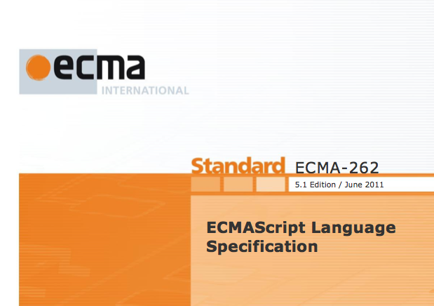
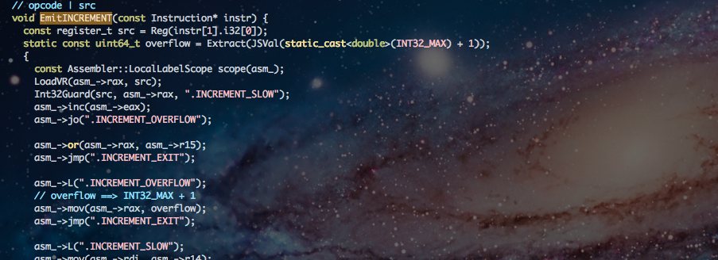
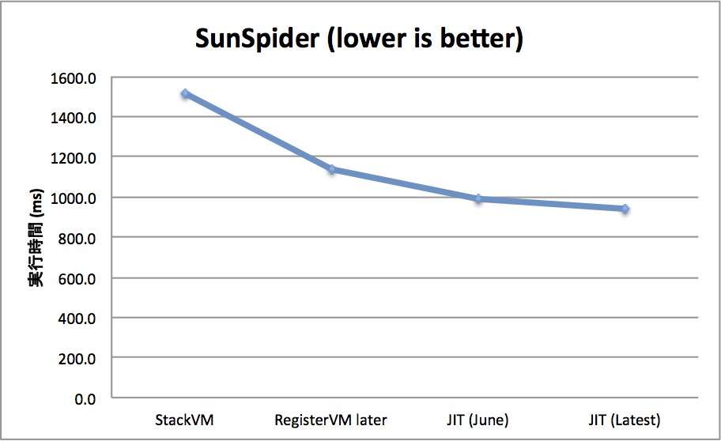
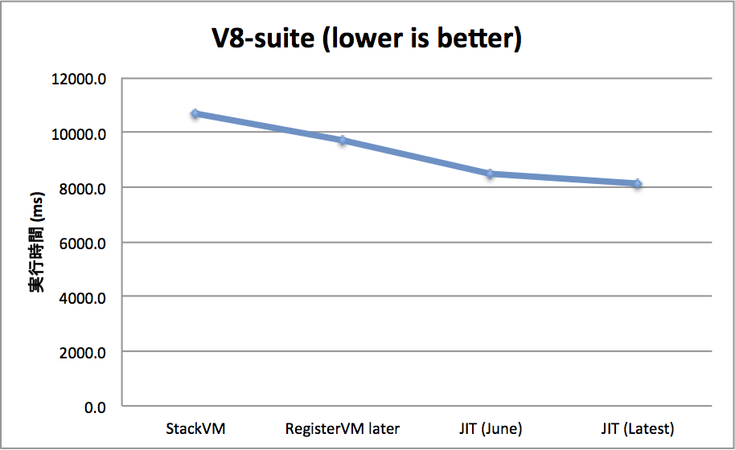
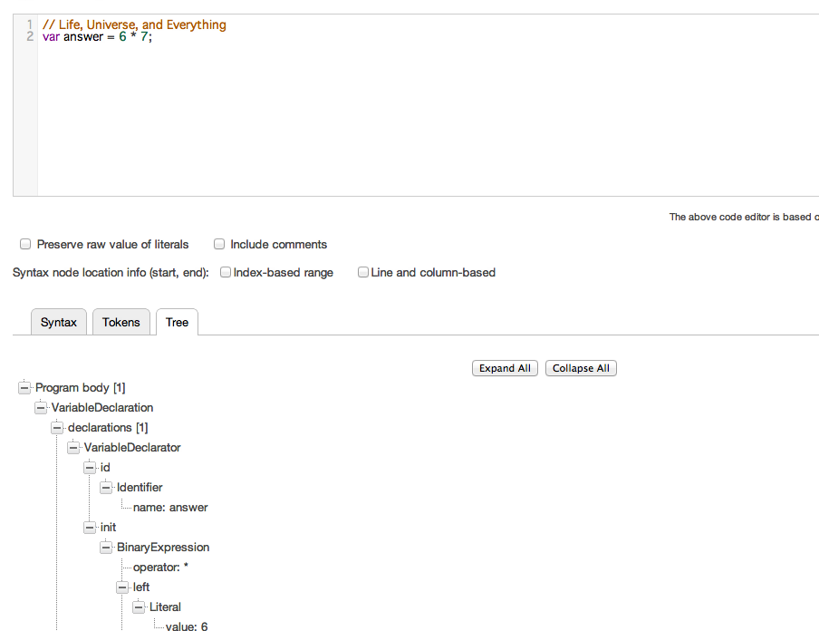

<h1>lv5
The most precise ECMAScript engine</h1>

 
 
 
 
 
 
 

<a href="https://twitter.com/Constellation" rel="author" style="position:absolute;bottom:40%;right:10%;">@Constellation</a>

---

iv / lv5
========

---

背景
====

- JavaScriptの発展は目覚ましい
- ところで
    - JavaScriptには仕様があるというのをご存知でしょうか?

---

ECMA262 - ECMAScript
====================

- 現行最新版は5.1th
- 6th (a.k.a. ES.next) rev9 draftが公開されている

</img>

---

Spec violations
===============

- あなたの使っているECMAScript engine, 本当に, 100% 仕様準拠していますか?
- なんとしてでも, 100%仕様に準拠したengineが欲しい!
    - ですよね?
    - 作りましょう

---

iv / lv5
========

- たとえ何があっても仕様準拠を第一に掲げるengine
    - どんなに遅くなろうとも
    - 遅くなるような自体になったら, 独自実装をせず, 仕様を直しに行きましょう
- spec conformance suite result (test262)

---

Contributions
=============

- test262にbug reportとか
    - https://bugs.ecmascript.org/show\_bug.cgi?id=215
    - https://bugs.ecmascript.org/show\_bug.cgi?id=218
    - https://bugs.ecmascript.org/show\_bug.cgi?id=270
    - https://bugs.ecmascript.org/show\_bug.cgi?id=271
    - https://bugs.ecmascript.org/show\_bug.cgi?id=287
    - https://bugs.ecmascript.org/show\_bug.cgi?id=294
- ECMA262のbug reportとか
    - https://bugs.ecmascript.org/show\_bug.cgi?id=129
    - https://bugs.ecmascript.org/show\_bug.cgi?id=387
    - https://bugs.ecmascript.org/show\_bug.cgi?id=417

---

<blockquote cite="http://accel-world.net/" title="黒雪姫先輩">

もっと先へ――《加速》したくはないか、少年

<cite style="font-size:70%;"><a href="http://accel-world.net/">アクセル・ワールド - 黒雪姫先輩</a></cite>
</blockquote>

- 高速化したい...

---

railgun: Register VM
====================

- Register VM
    - Lua, JSCに影響を受けた設計
- 1 passで効率的なBytecodeを出力
    - heap変数でないものはきちんとvirtual registerに置く
    - Stack VMのpush popを行わず, localへの代入も, virtual registerへ直接書き込む
    - 右辺に代入が存在する場合でも1 passで適切なBytecodeを

---

railgun: result 1
=================

- argumentsのregisterによる直接指定

<pre>
function t(a, b) {
  return a + b;
}
</pre>

<pre>
[code] local: 0 heap: 0 registers: 1
000000: BINARY_ADD r0 r-9 r-10
000002: RETURN r0
</pre> <!-- 悲しみ... -->

---

railgun: result 2
=================

- 右辺に代入が存在する場合でも1 passで適切なBytecodeを

<pre>
function test() {
  var a = 10;
  return a + (a = 20);
}
</pre>

<pre>
[code] local: 1 heap: 0 registers: 2
000000: MV r0 k0
000002: MV r1 r0
000004: MV r0 k1
000006: BINARY_ADD r1 r1 r0
000008: RETURN r1
</pre> <!-- 悲しみ... -->

---

<blockquote cite="http://accel-world.net/" title="黒雪姫先輩">

もっと先へ――《加速》したくはないか、少年

<cite style="font-size:70%;"><a href="http://accel-world.net/">アクセル・ワールド - 黒雪姫先輩</a></cite>
</blockquote>

- **もっと** 高速化したい...

---

breaker: JIT Compiler
=====================

- railgunによって出力されるBytecodeを受け取り, Context Threading JIT Compileを行う
- online assemblerとして [xbyak](https://github.com/herumi/xbyak) を用い x64 codeを出力

</img>

---

breaker: Type Analysis
======================

- 低コストでそこそこ価値のある型解析を行いたい
    - iterationを行うと, basic blockを表す構造や, bitvector等, 様々なものが必要になる
    - 1 passで高価な構造なしにそこそこ価値のある型解析を
- basic blockごとに型を解析, virtual register間で伝搬し, constant foldingと型の伝搬を同時に
- 主に int32\_t 演算について特殊化, guardを取り除き, x64で直接扱う
- 将来的には, backward jump以外についてはmergeを行なってbasic block間での型解析も行う予定

---

benchmark result
================

<table style="margin-left:auto;margin-right:auto;margin-top:20%;width:80%;">
<tr>
  <th></th>
  <th>SunSpider (ms)</th>
  <th>V8-Suite (ms)</th>
</tr>
<tr>
  <td>StackVM</td>
  <td style="text-align:right">1512.7</td>
  <td style="text-align:right">10691.2</td>
</tr>
<tr>
  <td>RegisterVM Later</td>
  <td style="text-align:right">1136.3</td>
  <td style="text-align:right">9720.3</td>
</tr>
<tr>
  <td>JIT (June)</td>
  <td style="text-align:right">986.0</td>
  <td style="text-align:right">8460.0</td>
</tr>
<tr>
  <td>JIT (Latest)</td>
  <td style="text-align:right">937.9</td>
  <td style="text-align:right">8130.0</td>
</tr>
</table>

---

benchmark result: 1
===================

</img>

---

benchmark result: 2
===================

</img>

---

WIP: Machine code level MonoIC
==============================

</img>

参考画像

- Monomorphic Inline Caching
- Global変数の参照速度が向上
- bytecode levelでの実装は前からあったが, x64 machine code levelでの実装を行なっている

---

shibuya - ES.next
=================

---

[esprima](http://esprima.org/)
==============================

- ECMAScript parser infrastructure ([twitter](https://twitter.com/esprima))
    - Created by [@ariyahidayat](https://twitter.com/ariyahidayat)
    - Contributed by [@Contellation](https://twitter.com/Constellation)

</img>

---

esprima - harmony branch
========================

- ES.next をparseすることを目標に実装を行なっている
    - module declaration
    - import / export declaration
    - arrow function
    - class declaration
    - destructuring assignment
    - etc...

---

ES.nextへ
=========

- 仕様が完成し, 主要engineが実装するまで待つ?
- No!
- draft段階からES.nextを理解して行きましょう!
- ES.next engine
    - shibuya project

---

Shibuya: ES.next engine
========================================

- lv5から更に一歩進んで, 仕様と実装のAbstract Operationレベルでの一致を目指す
    - どうしてもできないところ以外(yield)
- [GitHub](https://github.com/Constellation/shibuya)
- ES5.1で記述する
    - esprimaをparserとして用いる

---

Shibuya: status
===============

<pre style="font-size:60%">
{
  class Base {
    sayHello() {
      inspect('base');
    }
  };

  class Derived extends Base {
    sayHello() {
      inspect('derived');
      super();
    }
  };

  let i = new Derived;
  i.sayHello();
}
</pre>

- まだまだ全然できていないので, 実装中...

---

bugs in ES.next draft
=====================

- 実装することによって, draftのbug, issueを発見する
    - [issue 368](https://bugs.ecmascript.org/show_bug.cgi?id=368)
    - [issue 414](https://bugs.ecmascript.org/show_bug.cgi?id=414)
    - [issue 415](https://bugs.ecmascript.org/show_bug.cgi?id=415)
    - [issue 416](https://bugs.ecmascript.org/show_bug.cgi?id=416)
    - [issue 417](https://bugs.ecmascript.org/show_bug.cgi?id=417)

---

まとめ
=====

- ECMAScriptの未来は明るい!
- 楽しい!
- みなさんもぜひ!

---

ありがとうございました
======================
