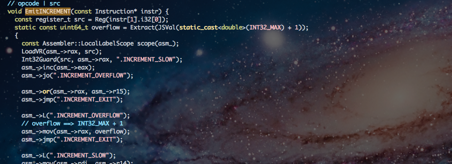

lv5.current (ちらっと)
======================

 
 
 
 
 
 
 

<a href="https://twitter.com/Constellation" rel="author" style="position:absolute;bottom:40%;right:10%;">@Constellation</a>

---

iv / lv5
========

- たとえ何があっても仕様準拠を第一に掲げるengine
- spec conformance suite result (test262)

---

Contributions
=============

- test262にbug reportとか
    - https://bugs.ecmascript.org/show\_bug.cgi?id=215
    - https://bugs.ecmascript.org/show\_bug.cgi?id=218
    - https://bugs.ecmascript.org/show\_bug.cgi?id=270
    - https://bugs.ecmascript.org/show\_bug.cgi?id=271
    - https://bugs.ecmascript.org/show\_bug.cgi?id=287
    - https://bugs.ecmascript.org/show\_bug.cgi?id=294
- ECMA262のbug reportとか
    - https://bugs.ecmascript.org/show\_bug.cgi?id=129
    - https://bugs.ecmascript.org/show\_bug.cgi?id=387
    - https://bugs.ecmascript.org/show\_bug.cgi?id=417

---

<blockquote cite="http://accel-world.net/" title="黒雪姫先輩">

もっと先へ――《加速》したくはないか、少年

<cite style="font-size:70%;"><a href="http://accel-world.net/">アクセル・ワールド - 黒雪姫先輩</a></cite>
</blockquote>

- 高速化したい...

---

最近の変更
==========

- LL Decadeの際に喋ったこと
- あのあと入ったのも...

---

breaker: JIT Compiler
=====================

- railgunによって出力されるBytecodeを受け取り, Context Threading JIT Compileを行う
- online assemblerとして [xbyak](https://github.com/herumi/xbyak) を用い x64 codeを出力

</img>

---

breaker: Type Analysis
======================

- 低コストでそこそこ価値のある型解析を行いたい
    - iterationを行うと, basic blockを表す構造や, bitvector等, 様々なものが必要になる
    - 1 passで高価な構造なしにそこそこ価値のある型解析を
- basic blockごとに型を解析, virtual register間で伝搬し, constant foldingと型の伝搬を同時に
- 主に int32\_t 演算について特殊化, guardを取り除き, x64で直接扱う
- 将来的には, backward jump以外についてはmergeを行なってbasic block間での型解析も行う予定

---

breaker: MonoIC for Global variable
===================================

</img>

IC! 参考画像

- bytecode levelでの実装は前からあったが, x64 machine code levelでの実装
- LL Decadeの際, WIPでしたが, 実装されました

---

breaker: More compact property table
====================================

- 従来はECMA262の仕様に近いpropety tableの実装だった
    - name => Property Descriptor
    - 大抵data propertyでe:true, c:true, w:trueなのに, property descriptorが大きい
- attribution情報をmapに移す
    - attribution変更でmap transition
- accessorを特殊なobjectで管理

---

breaker: More efficient string
==============================

- 前よりefficientなstring
- 自分では妥協版と呼んでいたもの...
    - string valueもGCから取ってくることで, finalizerをいらなくする

---

benchmark result
================

<table style="margin-left:auto;margin-right:auto;margin-top:20%;width:80%;">
<tr>
  <th></th>
  <th>SunSpider (ms)</th>
  <th>V8-Suite (ms)</th>
</tr>
<tr>
  <td>StackVM</td>
  <td style="text-align:right">1512.7</td>
  <td style="text-align:right">10691.2</td>
</tr>
<tr>
  <td>RegisterVM Later</td>
  <td style="text-align:right">1136.3</td>
  <td style="text-align:right">9720.3</td>
</tr>
<tr>
  <td>JIT (June)</td>
  <td style="text-align:right">986.0</td>
  <td style="text-align:right">8460.0</td>
</tr>
<tr>
  <td>JIT (LL Decade)</td>
  <td style="text-align:right">937.9</td>
  <td style="text-align:right">8130.0</td>
</tr>
<tr>
  <td>JIT (Latest)</td>
  <td style="text-align:right">710.0</td>
  <td style="text-align:right">6521.0</td>
</table>

---

benchmark result: 1
===================

</img>

---

benchmark result: 2
===================

</img>

---

lv5.next
========

- Polymorphic IC for Property operation (x64)
- SSE, double specialized path
    - int32\_t pathだけでなく, double specialized pathも
- More effective type analysis
