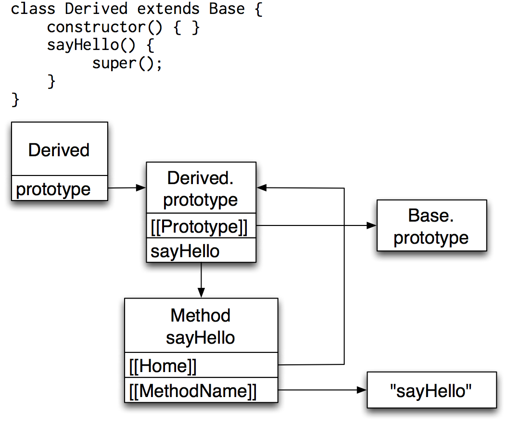
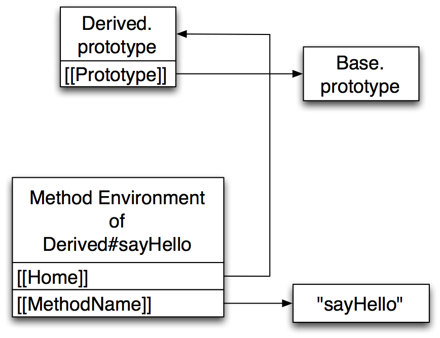
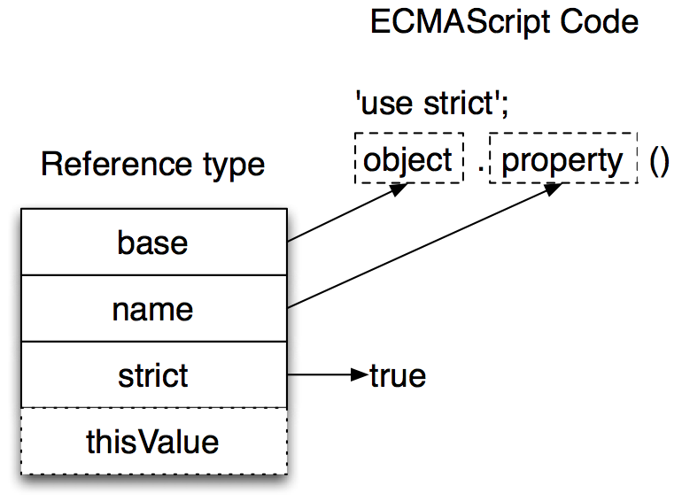
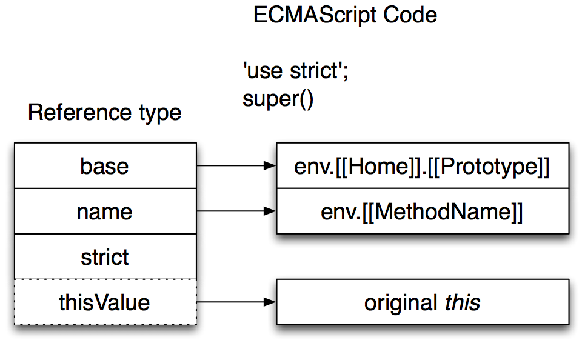
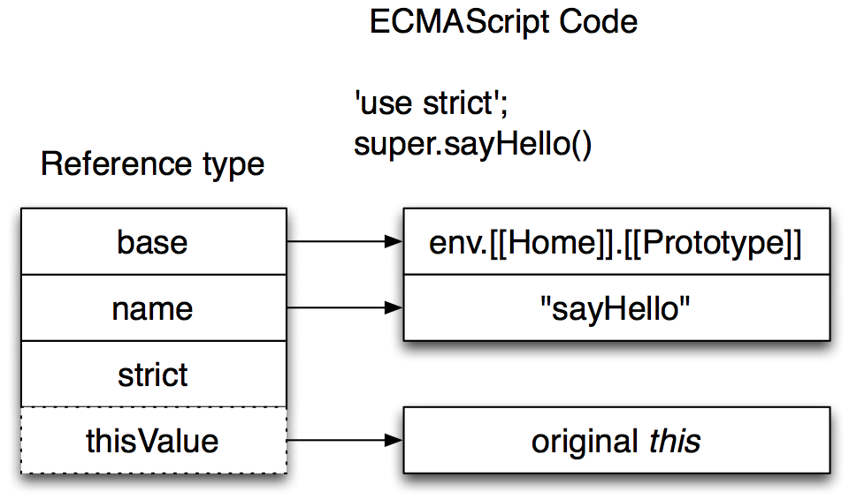
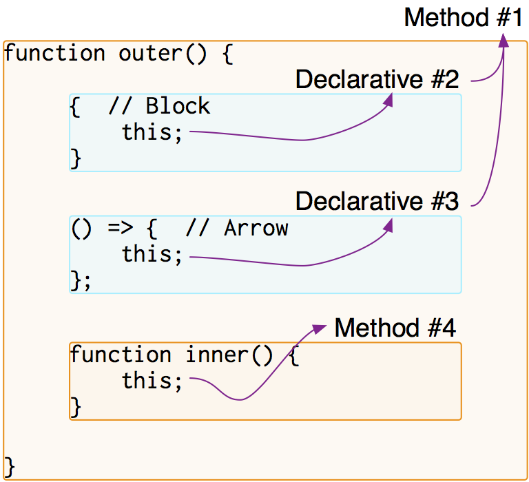

ES.next - class, arrow, quasi etc.
==================================

 
 
 
 
 
 
 

<a href="https://twitter.com/Constellation" rel="author" style="position:absolute;bottom:40%;right:10%;">@Constellation</a>

---

This slide is based on rev9 draft
=================================

---

Preparation 1
=============

- You can try harmony syntax by esprima
- Instructions
    - `git clone https://github.com/ariya/esprima.git`
    - `cd esprima`
    - `git checkout -b harmony origin/harmony`
    - `open demo/parse.html`

---
Preparation 2
=============

- Yesterday, I've implemented Template strings for esprima
- If you would like to use quasi (2012/08/12)
    - `git remote add constellation https://github.com/Constellation/esprima.git`
    - `git fetch constellation`
    - `git checkout -b harmony-template-strings constellation/harmony-template-strings`

---

class Class extends ECMAScript
==============================

---

Class - overview
================

    !javascript
    // extends Base
    class Derived extends Base {
      // constructor
      constructor() {
        this.type = 'derived';
      }

      sayHello() {
        console.log('derived');
        // we can call super of own method
        super();
      }

      sayHello2() {
        // we can call other super mathod
        super.sayHello();
      }
    }

---

DEMO - [esprima harmony](https://github.com/ariya/esprima/tree/harmony)
=======================================================================

---

How to resolve super
====================

</img>

---

Abstract code (not precise)
===========================

- sayHello method function holds own method name and home

        !javascript
        function sayHello() {
          ...
        }
        sayHello.__MethodName__ = 'sayHello';
        sayHello.__Home__ = Derived.prototype;
        Derived.prototype.sayHello = sayHello;

---

MethodEnvironment
=================

</img>

---
MethodEnvironment summary
=========================

- Holds `method.[[Home]]` object as `environment.[[HomeObject]]`
- Holds `method.[[MethodName]]` object as `environment.[[MethodName]]`
- `environment.[[GetSuperBase]]()` returns `environment.[[HomeObject]].[[Prototype]]`

---

Reference - internal type
=========================

</img>

---

Super reference - super()
=========================

</img>

---

Super reference - super.sayHello()
==================================

</img>

---
Conclusion - Class
==================

- Described
    - class overview
    - super resolution

---

Next => ArrowFunction
=====================

---

ArrowFunction - overview
========================

    !javascript
    class Dog {
      bow(n) {
        console.log(n + ' bow!');
      }

      say() {
        // `this` is Dog instance
        // arrow can take expression as body
        [1, 2, 3, 4].forEach(e => this.bow(e));

        // this also works fine
        () => {
          this.bow(100);
        };
      }
    }

---

DEMO - [esprima harmony](https://github.com/ariya/esprima/tree/harmony)
=======================================================================

---
Declarative & Method Environment
================================

- Declarative Environment
    - Block, ArrowFunction
    - doesn't hold thisValue
- Method Environment
    - normal Function
    - holds thisValue

---

This Resolution
===============

- Searching thisValue recursively

</img>

---
Conclusion - ArrowFunction
==========================

- Described
    - ArrowFunction overview
    - this resolution

---

Last\`template strings\`
========================

---

template strings - overview
===========================

    !javascript
    // using expression in ${}
    let hello = `Hello ${name}!`;

    // We can write raw string
    let raw = String.raw`This is
    raw string including
    LineTerminator`;

    // And we can use it like this
    let html = escapeHTML`
${url}
`;

---

DEMO [esprima harmony with my patch](https://github.com/ariya/esprima/pull/102)
=================================================================================

---

raw & cooked
============

- QuasiLiteral has 2 modes
    - cooked
        - interpret escape sequences
    - raw
        - escape sequences are interpreted literally

---

QuasiLiteral CallSite
=====================

- 

        !javascript
        // example quasi literal
        let name = "Yusuke Suzuki";
        re`hello ${name}!\nGood afternoon.`;

- 

        !javascript
        // comes to re function
        cooked = ['hello ', '!\nGood afternoon.'];
        cooked.raw = ['hello ', '!\\nGood afternoon'];
        re(cooked, name);

---
[String.raw impl (not precise)](http://people.mozilla.org/~jorendorff/es6-draft.html#sec-15.5.3.4)
==================================================================================================

    !javascript
    function StringRaw(callSite) {
      var raw = callSite.raw;
      var len = raw.length;
      if (!len) {
        return '';
      }
      var next = 0;
      var result = '';
      while (true) {
        result += raw[next];
        ++next;
        if (next === len) {
          return result;
        }
        result += arguments[next];
      }
    }

---

Conclusion - template strings
=============================

- Described
    - template strings overview
    - raw & cooked modes
    - how callsite works

---

shibuya - ES.next
=================

---

WIP: Shibuya ES.next engine
=======================================

- Implement ES.next engine in ES5.1
    - To understand ES.next interpretation algorithm
    - To research how to create ES.next engine efficiently in my engine [lv5](https://github.com/Constellation/iv) written in C++
- [GitHub](https://github.com/Constellation/shibuya)
- Use esprima as parser
- Now implementing...
    - very poor
    - A lot of functions are not implemented yet.

---

[DEMO - Shibuya](https://github.com/Constellation/shibuya)
==========================================================

---

Conclusion
==========

- Described
    - class system
    - arrow function
    - quasi literal (template strings)

---

Thank you!
==========
